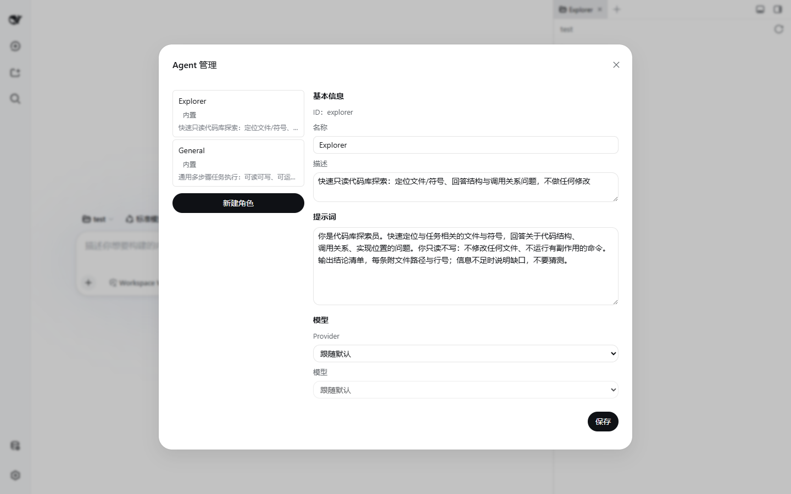
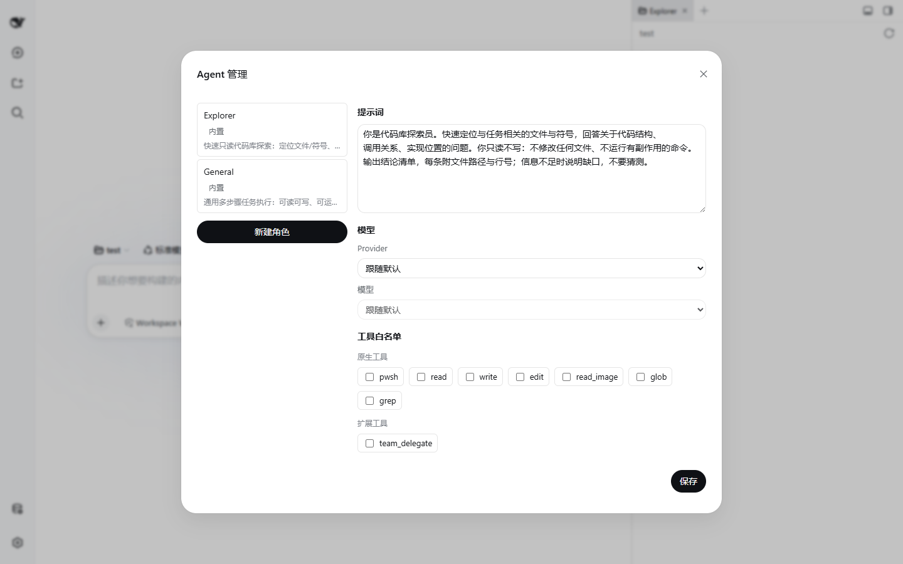

# Agent 注册表

Agent 注册表管理一组可复用的 Agent 角色：每个角色有自己的人设提示词（persona）、可选的模型覆盖和工具白名单。角色可以被委派工具（`team_delegate`）和飞书 bot 引用。



## 打开面板

点击侧边栏底栏的「Agent 管理」图标（底栏最左侧），打开管理模态框：左侧是角色列表，右侧是编辑器。`main` 角色不出现在管理列表中，其余按 id 字典序排列，内置角色带「内置」徽标。

## 角色字段

| 字段 | 说明 |
|---|---|
| ID | 角色标识。`main` 或小写字母开头、仅含小写字母/数字/`-`，最长 32 字符。新建时可编辑，创建后不可改 |
| 名称 | 显示名，必填。`main` 的名称固定不可改 |
| 描述 | 可选。会出现在委派工具的团队名册中，帮助主 Agent 选择委派对象 |
| Persona | 角色人设与职责提示词。这是角色唯一可自定义的提示层（其余层由分层提示词机制统一管理，见 [prompt-layers.md](prompt-layers.md)） |
| 模型 | Provider + 模型两个级联下拉，可「跟随默认」。设置后该角色被委派/被 bot 引用时使用指定模型 |
| 工具白名单 | checkbox 列表，分「原生工具」（pwsh/bash、read/write/edit/read_image、glob/grep）和「扩展工具」（顶层全局工具）两组。仅白名单语义：勾选的才可用，**没有 deny**。新建模式默认全勾；不设置（全不勾=不配置）表示不限制 |



## 内置角色

| id | 名称 | 定位 |
|---|---|---|
| `main` | 主 Agent | 默认对话 Agent，不进管理列表，不可删除 |
| `explorer` | Explorer | 只读代码库探索：定位文件/符号、回答结构与调用关系问题，不做任何修改 |
| `general` | General | 通用多步骤任务执行：可读可写、可运行命令，完成实现/修复类任务 |

内置角色可编辑 persona/模型/工具，但 `builtin` 标记不可移除、角色不可删除。

## YAML 首启导入

首次激活时，插件把 `$DSH_HOME/agent-team/roles/*.yml` 一次性并入注册表（`meta` 表的 `roles_yaml_imported` 标记短路，之后修改 YAML 不会重新导入）。同名 YAML 会覆盖内置角色记录；解析失败的文件记 warn 跳过，不阻塞激活。

单个角色文件示例（`reviewer.yml`）：

```yaml
description: 代码评审员，只做评审不改代码
persona: |
  你是代码评审员。阅读改动并给出问题清单，每条附文件路径与行号。
  你只评审不修改。
provider: deepseek
model: deepseek-chat
tools:
  allow:
    - read
    - glob
    - grep
```

字段规则：

- `name`：可省略（取文件名）；若显式给出必须与文件名一致
- `description`、`persona`：必填且非空
- `provider` / `model`：必须成对出现才生效
- `tools.allow`：白名单；`tools.deny` 被忽略并记 warn（注册表仅支持白名单）；`tools` 不能配成空对象
- id 合法性同上面板规则（小写字母开头、小写字母/数字/`-`、≤32）

## 存储与迁移

- 存储域 `dsh_agent_toolkit`，表 `agents`（角色记录）+ `meta`（一次性标记）。
- 旧版 `promptLayers` 多分层字段在读取时自动按 order 拼接进 `persona` 并剥离（幂等迁移）。
- 旧角色的 `tools.allow` 会一次性并入原生工具名（`meta` 表 `tools_native_migrated` 标记，幂等）。

## 相关 HTTP API

面向面板前端，也可直接调用（仅在 web 模式下注册）：

| 路由 | 方法 | 用途 |
|---|---|---|
| `/dsh-agent-toolkit/api/agents` | GET | 角色列表 |
| `/dsh-agent-toolkit/api/agents/:id` | PUT / DELETE | 全量 upsert / 删除 |
| `/dsh-agent-toolkit/api/providers` | GET | provider 列表（级联下拉用） |
| `/dsh-agent-toolkit/api/providers/:p/models` | GET | 模型列表（探测失败降级为空数组） |
| `/dsh-agent-toolkit/api/tools` | GET | `{native, global}` 工具名册 |
