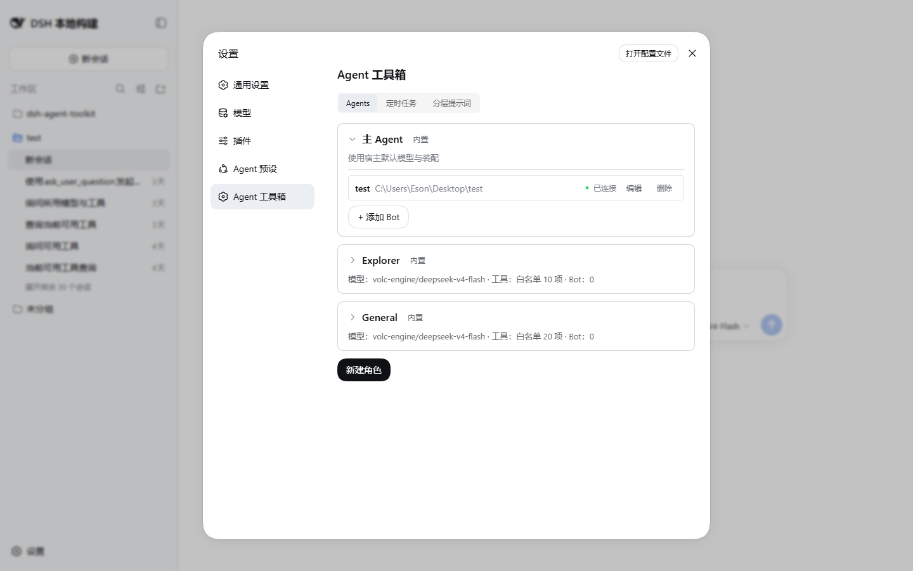
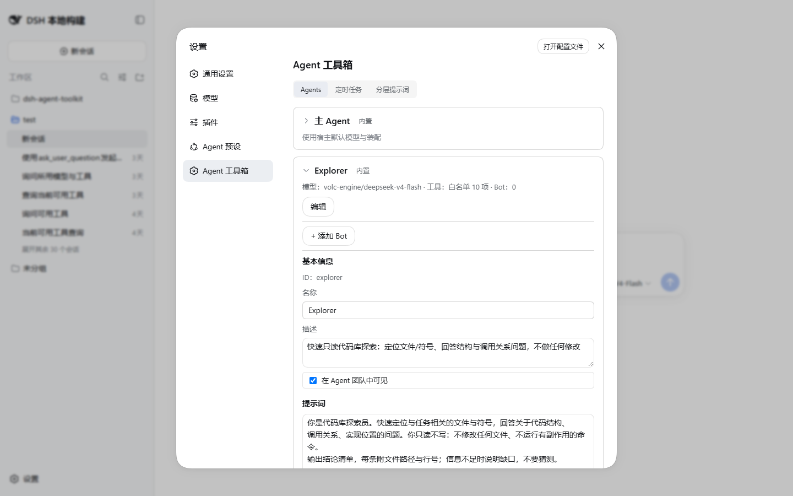

# Agent 注册表

Agent 注册表管理一组可复用的 Agent 角色：每个角色有自己的人设提示词（persona）、可选的模型覆盖和工具白名单。角色可以被委派工具（`team_delegate`）和飞书 bot 引用。



## 打开面板

打开宿主**设置面板 → 「Agent 工具箱」**（页内三 tab：Agents / 定时任务 / 分层提示词），默认即 Agents 页。页面为**卡片流**：按创建时间升序排列，`main`（主 Agent）恒置顶且只读（无编辑/删除按钮，仅显示「使用宿主默认模型与装配」），内置角色带「内置」徽标且不显示删除按钮。每张卡片下方是该 Agent 名下的飞书 Bot 列表（含「+ 添加 Bot」按钮，归属锁定到本卡）。点卡片内「编辑」在该卡片内（Bot 列表下方）**内联展开**编辑器；点列表最底部的「新建角色」按钮，新建表单在**列表顶部**内联展开。保存/删除成功显示 toast。

## 角色字段

| 字段 | 说明 |
|---|---|
| ID | 角色标识。`main` 或小写字母开头、仅含小写字母/数字/`-`，最长 32 字符。新建时可编辑，创建后不可改 |
| 名称 | 显示名，必填。`main` 的名称固定不可改 |
| 描述 | 可选。会出现在委派工具的团队名册中，帮助主 Agent 选择委派对象 |
| Persona | 角色人设与职责提示词。这是角色唯一可自定义的提示层（其余层由分层提示词机制统一管理，见 [prompt-layers.md](prompt-layers.md)） |
| 模型 | Provider + 模型两个级联下拉，可「跟随默认」。设置后该角色被委派/被 bot 引用时使用指定模型 |
| 工具白名单 | 「不限制（继承会话全部工具）/ 自定义白名单」radio 二选一 + checkbox 列表，分「团队 preset 工具」（动态枚举 agent-team preset 真实挂载的工具面）和「全局工具」（顶层全局工具）两组。仅白名单语义：勾选的才可用，**没有 deny**。新建模式默认自定义 + 全勾；自定义下全不勾不可保存（改选不限制请用 radio） |

bot 会话与委派两条路径加载角色白名单时都会与会话真实可见面求交：不可见名记 warn 忽略（不再抛错），求交后为空则报错（防静默零工具会话）。




## 删除与守卫

删除角色需在卡片内**两段确认**（按钮变为「确认删除？」后再点一次）。若该角色名下仍有飞书 Bot，服务端返回 409，页面提示「无法删除：名下仍有 N 个 Bot，请先删除或移出这些 Bot」；内置角色不显示删除按钮。

## 内置角色

| id | 名称 | 定位 |
|---|---|---|
| `main` | 主 Agent | 默认对话 Agent，卡片流中恒置顶只读，不可删除 |
| `explorer` | Explorer | 只读代码库探索：定位文件/符号、回答结构与调用关系问题，不做任何修改 |
| `general` | General | 通用多步骤任务执行：可读可写、可运行命令，完成实现/修复类任务 |

内置角色可编辑 persona/模型/工具，但 `builtin` 标记不可移除、角色不可删除。`explorer` 默认携带只读白名单 10 个（`pwsh`/`bash` + `read`/`read_image`/`glob`/`grep` + `web_search`/`todo_write`/`job_list`/`job_output`/`skill`），委派时硬约束只读；`general` 默认携带 agent-team preset 面全量 20 个工具的显式白名单（不含 `team_delegate` 与 `run_code`，禁二级委派）。两者均可在面板改选「不限制」或自行调整。

## YAML 首启导入

首次激活时，插件把 `$DSH_HOME/agent-team/roles/*.yml` 一次性并入注册表（`meta` 表的 `roles_yaml_imported` 标记短路，之后修改 YAML 不会重新导入）。同名 YAML 会覆盖内置角色记录；解析失败的文件记 warn 跳过，不阻塞激活。

单个角色文件示例（`reviewer.yml`）：

```yaml
description: 代码评审员，只做评审不改代码
persona: |
  你是代码评审员。阅读改动并给出问题清单，每条附文件路径与行号。
  你只评审不修改。
provider: deepseek
model: deepseek-chat
tools:
  allow:
    - read
    - glob
    - grep
```

字段规则：

- `name`：可省略（取文件名）；若显式给出必须与文件名一致
- `description`、`persona`：必填且非空
- `provider` / `model`：必须成对出现才生效
- `tools.allow`：白名单（仅支持 allow，无 deny 语义）；`tools` 不能配成空对象
- id 合法性同上面板规则（小写字母开头、小写字母/数字/`-`、≤32）

## 存储与迁移

- 存储域 `dsh_agent_toolkit`，表 `agents`（角色记录）+ `meta`（一次性标记）。
- 旧版 `promptLayers` 多分层字段在读取时自动按 order 拼接进 `persona` 并剥离（幂等迁移）。
- 旧角色的 `tools.allow` 会一次性并入原生工具名（`meta` 表 `tools_native_migrated` 标记，幂等）。
- 存量自定义白名单会一次性并入「preset 面 − 内置常量」差集（`meta` 表 `tools_preset_catalog_migrated` 标记，幂等；内置角色不 widen，枚举失败下次启动重试）。
- 未配置工具的存量 `explorer` 会一次性补默认只读白名单（`meta` 表 `explorer_readonly_migrated` 标记，幂等）；已自行配置过工具的不受影响。
- 仍是旧默认名单的内置角色会一次性更新为重选后的新名单（`meta` 表 `builtin_tools_recatalog_migrated` 标记，幂等；在面板改过的记录视为自定义，跳过）。注意：存量 general 的「不限制」视同旧默认，会被改写为显式 20 个白名单（且不再继承 team_delegate）；如需保留不限制，升级后在面板改选一次即可。

## 相关 HTTP API

面向面板前端，也可直接调用（仅在 web 模式下注册）：

| 路由 | 方法 | 用途 |
|---|---|---|
| `/dsh-agent-toolkit/api/agents` | GET | 角色列表 |
| `/dsh-agent-toolkit/api/agents/:id` | PUT / DELETE | 全量 upsert / 删除 |
| `/dsh-agent-toolkit/api/providers` | GET | provider 列表（级联下拉用） |
| `/dsh-agent-toolkit/api/providers/:p/models` | GET | 模型列表（探测失败降级为空数组） |
| `/dsh-agent-toolkit/api/tools` | GET | `{preset, global}` 工具名册 |
