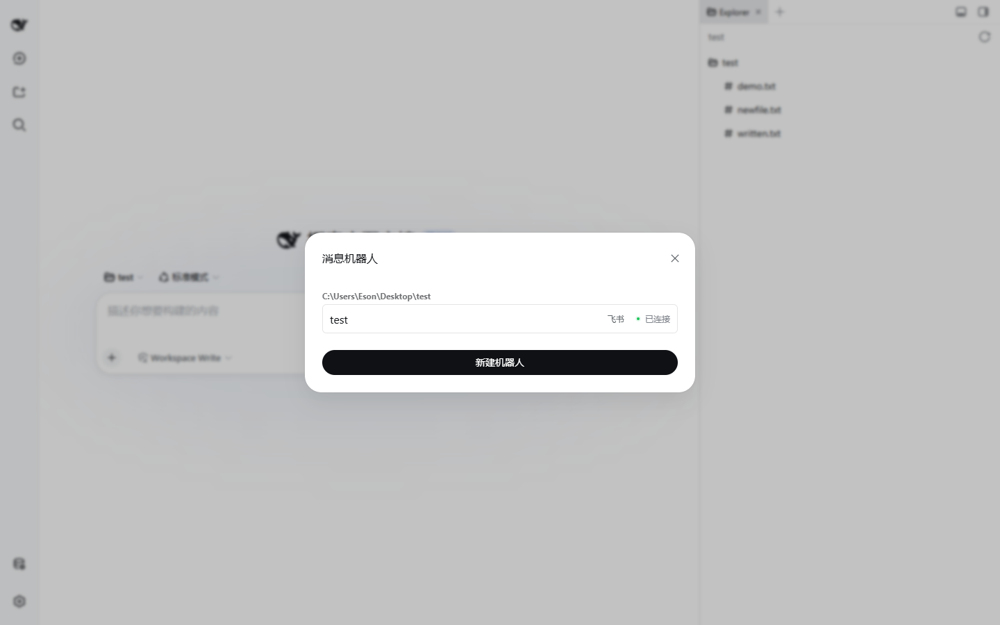
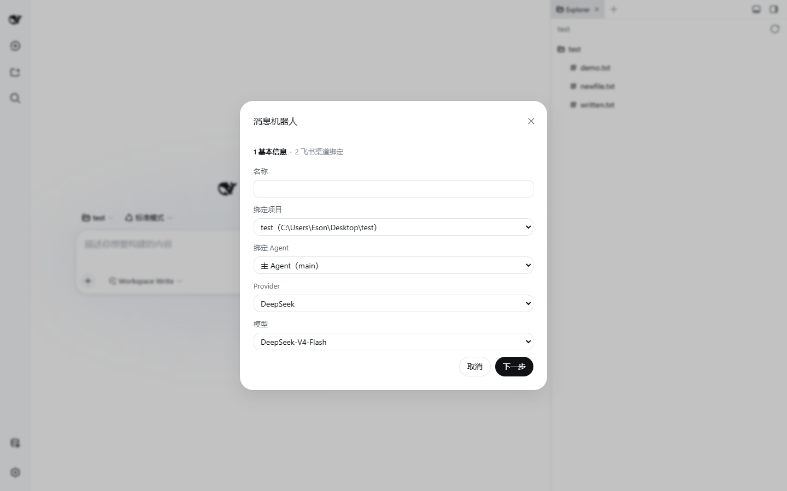
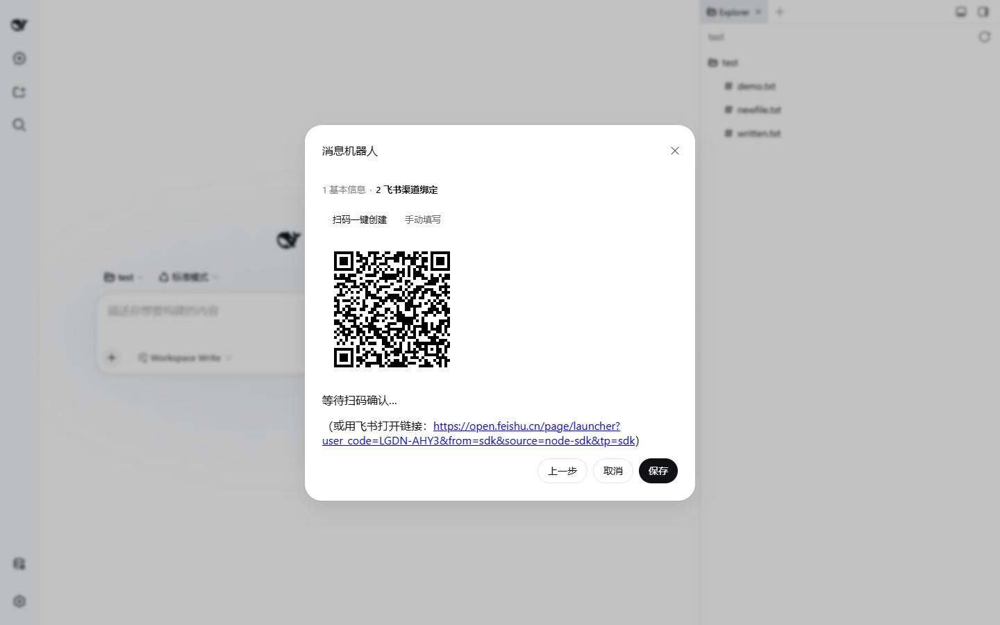

# 飞书 Bots

把一个 dsh Agent 绑定到飞书（Lark）自建应用，就能在飞书单聊/群聊里直接和 Agent 对话：消息走长连接接收，回复以流式卡片实时更新。

## 打开面板

点击侧边栏底栏的「消息机器人」，模态框按项目分组展示全部 bot：名称、飞书徽标、连接状态点（已连接 / 连接中 / 重连中 / 空闲 / 连接失败 / 未运行）。

## 创建 bot（两步向导）

**第 1 步：基本信息**

| 字段 | 说明 |
|---|---|
| 名称 | 1-64 字符，仅用于展示 |
| 绑定项目 | 从工作区列表选择。bot 收到的消息会在该项目目录下建会话执行，**一个 bot 绑定一个项目** |
| 绑定 Agent | `main` 或注册表中的角色。选角色则该 bot 会话使用角色的 persona / 模型 / 工具白名单 |
| Provider / 模型 | bot 会话使用的模型；不选则回退到当前默认模型 |

**第 2 步：飞书渠道绑定**（两个 tab）

- **扫码一键创建**（推荐）：进入第 2 步自动发起。插件通过飞书开放平台 OAuth 2.0 Device Authorization Grant 生成二维码，用飞书 App 扫码授权后自动创建自建应用，App ID 与凭据引用直接入库——**App Secret 存入宿主 credentials 服务，不落数据表**。轮询超时默认 10 分钟（`feishu.registerAppTimeoutMs`）。
- **手动填写**：填已有自建应用的 App ID（`cli_` 开头 + 16 位十六进制）和 App Secret（立即入 credentials）。

编辑已有 bot 时可改名称/项目/Agent/模型，但**不能换绑应用**——换绑需删除后重建。

## 在飞书里使用

**消息接收规则**：

- 只响应**真人**发送的**文本**消息（机器人消息、图片/文件等富消息不响应）
- 群聊中必须 **@机器人** 才响应；单聊直接发即可
- 消息按 `message_id` 去重，重复投递不会重复执行

**会话绑定与复用**：每个（bot, 群聊）组合绑定一个**持久会话**——同一个人/群多次发消息会复用同一会话，Agent 记得之前的对话上下文。单个会话同时只处理一条消息：上一条还在处理时再发消息，会收到「上一条还在处理中」的提示。

**运维指令**（整条消息就是指令时才触发，不走模型）：

| 指令 | 作用 |
|---|---|
| `/new` | 取消当前会话任务、清除绑定、开新会话（清空上下文重新开始） |
| `/stop` | 取消当前正在执行的任务（无任务时提示空闲） |
| `/status` | 显示绑定项目、会话 id、当前处理中/空闲状态 |

## 回复形态：流式卡片

Agent 工作时，回复以飞书卡片实时更新：

- **正文区**：助手输出文本，流式追加（默认 500ms 节流合并，`feishu.cardUpdateThrottleMs`）
- **过程区**：「思考与工具调用过程」折叠面板，展示思考片段与工具调用（字节上限 `feishu.processMaxBytes`，超限截尾保留最近内容）
- 内容过长时按 `feishu.cardMaxBytes`（默认 28KB，飞书单卡硬上限 30KB 留余量）自动拆成多张卡
- 收尾定格着色：✅ 输出完成 / ❌ 输出出错 / ⏹ 已取消
- 处理期间给你的消息加「处理中」表情（默认 `OneSecond`，可用 `feishu.processingReactionEmoji` 改），完成或出错后移除
- 卡片发送失败自动重试（3 次指数退避）；turn 之外的错误以文本通知发送错误摘要（最长 `feishu.errorDetailMaxChars` 字符）

## 相关配置

全部位于 `feishu.*` 命名空间下，默认值与含义见 [config-reference.md](config-reference.md)。模块整体可用 `modules.feishu: false` 关闭（关闭后不开存储域、不注册 API、面板入口消失）。

## 存储

- 存储域 `project_bot`：表 `bots`（bot 配置）+ `bindings`（(bot, 群聊) → 会话 id）
- App Secret 只存在于宿主 credentials 服务

## 相关 HTTP API

| 路由 | 方法 | 用途 |
|---|---|---|
| `/dsh-agent-toolkit/api/bots/bots` | GET/POST/PUT/DELETE | bot CRUD |
| `/dsh-agent-toolkit/api/bots/register-app` | POST | 发起一轮扫码注册 |
| `/dsh-agent-toolkit/api/bots/register-app/status?id=` | GET | 轮询扫码状态 |
| `/dsh-agent-toolkit/api/bots/tools` | GET | 全局工具列表 |
| `/dsh-agent-toolkit/api/bots/providers` | GET | provider 列表 |
| `/dsh-agent-toolkit/api/bots/models?provider=` | GET | 模型列表 |
