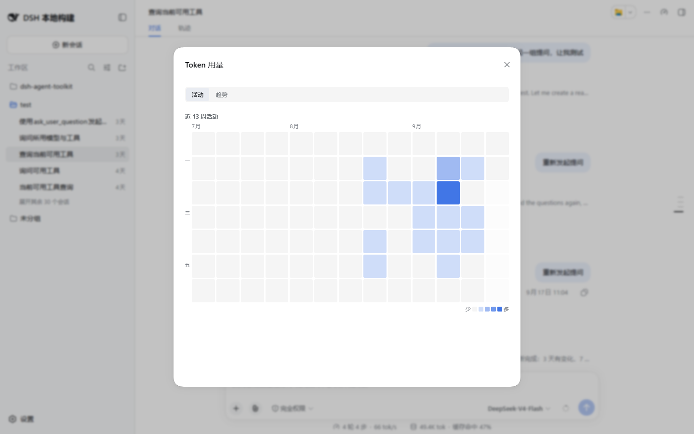
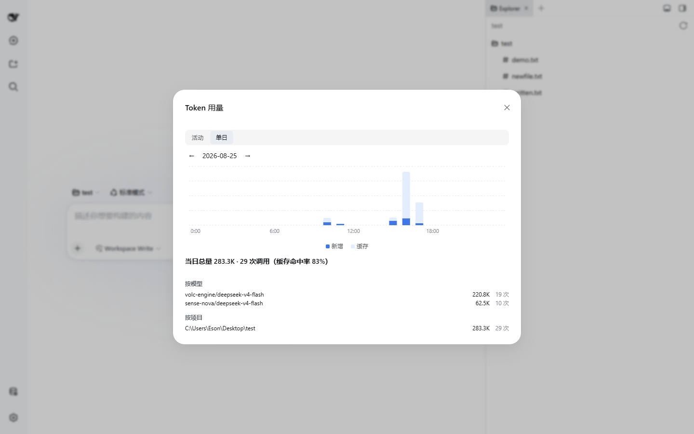

# Token 用量

按日/按小时采集所有会话的 token 消耗，提供 web 面板（活动热力图 + 单日图表）和 `/token-usage` 命令两种查看方式。

## 独立安装

本模块由依赖包 [`@dsh-agent-toolkit/token-usage`](https://www.npmjs.com/package/@dsh-agent-toolkit/token-usage) 提供。若只需要用量统计，可单独安装，功能/数据/路由与集成进 `dsh-agent-toolkit` 时完全一致：

```bash
dsh plugin add @dsh-agent-toolkit/token-usage
```

> 与 `dsh-agent-toolkit` 二选一：两者同时安装时，后到实例会自动停用用量功能（不重复计量、不注册 `/token-usage` 命令与面板），先到者完整工作；仍建议只装其一。

## 统计口径

监听全部会话事件，采集两类数据：

- **助手消息**：有 usage 上报时记 `input` / `output` / `cacheRead`（缓存命中）/ `cacheWrite`（缓存写入）；没有 usage 上报时用启发式估算并标记 `estimated`
- **上下文压缩**：`compaction` 事件单列统计

**计费总量** = input + output + cacheRead + cacheWrite + estimated。数据按配置时区（默认 `Asia/Shanghai`）归到「日」和「小时」两个粒度，每日记录内含：总量、24 小时桶、按模型（`provider/model`）、按会话、按项目（按 cwd 归类）、压缩单列。

## Web 面板

点击侧边栏底栏的「Token 用量」，模态框分两个 tab：

**活动 tab**：近 13 周活动热力图（7 行 × 13 列，GitHub 风格）。格子颜色深浅表示当日计费总量档位（0-4 共 5 档），悬停显示当日具体用量。



**单日 tab**：

- 24 小时堆叠柱状图：下半「新增」（input+output+estimated），上半「缓存」（cacheRead+cacheWrite）
- 当日汇总：计费总量、调用次数、估算标注、缓存命中率
- 细分：按模型、按项目两个维度
- 上下文压缩单列展示
- 顶部日期 pager 可前后翻页



## 命令行

在任何会话里使用宿主命令：

```
/token-usage              # 今日详情 + 近 7 日概览
/token-usage 2026-08-27   # 指定日期的单日详情（按模型/按项目/压缩）
```

参数必须是 `YYYY-MM-DD` 格式，否则返回用法提示。数量以 K/M/B 格式化（10 进制，1 位小数）。

## HTTP API

| 路由 | 参数 | 返回 |
|---|---|---|
| `/dsh-agent-toolkit/api/usage/daily` | `date=YYYY-MM-DD`（可空，缺省今日） | `{today, record}`：单日完整记录 |
| `/dsh-agent-toolkit/api/usage/range` | `days=N`（1..366，缺省 91） | `{today, days}`：近 N 天摘要（热力图数据源） |

## 存储与可靠性

- 存储域 `token_usage`，表 `daily`（key 为日期 `YYYY-MM-DD`）
- 采集写串行化落盘，单次失败被吞掉不中断后续采集（尽力而为）；存储域打开失败只影响本模块，不会崩掉宿主
- 模块可用 `modules.usage: false` 整体关闭（不开存储域、不注册命令与 API）

## 相关配置

| 配置项 | 默认值 | 说明 |
|---|---|---|
| `timezone` | `Asia/Shanghai` | 按日/按小时聚合使用的时区 |
| `modules.usage` | `true` | 是否启用本模块 |
